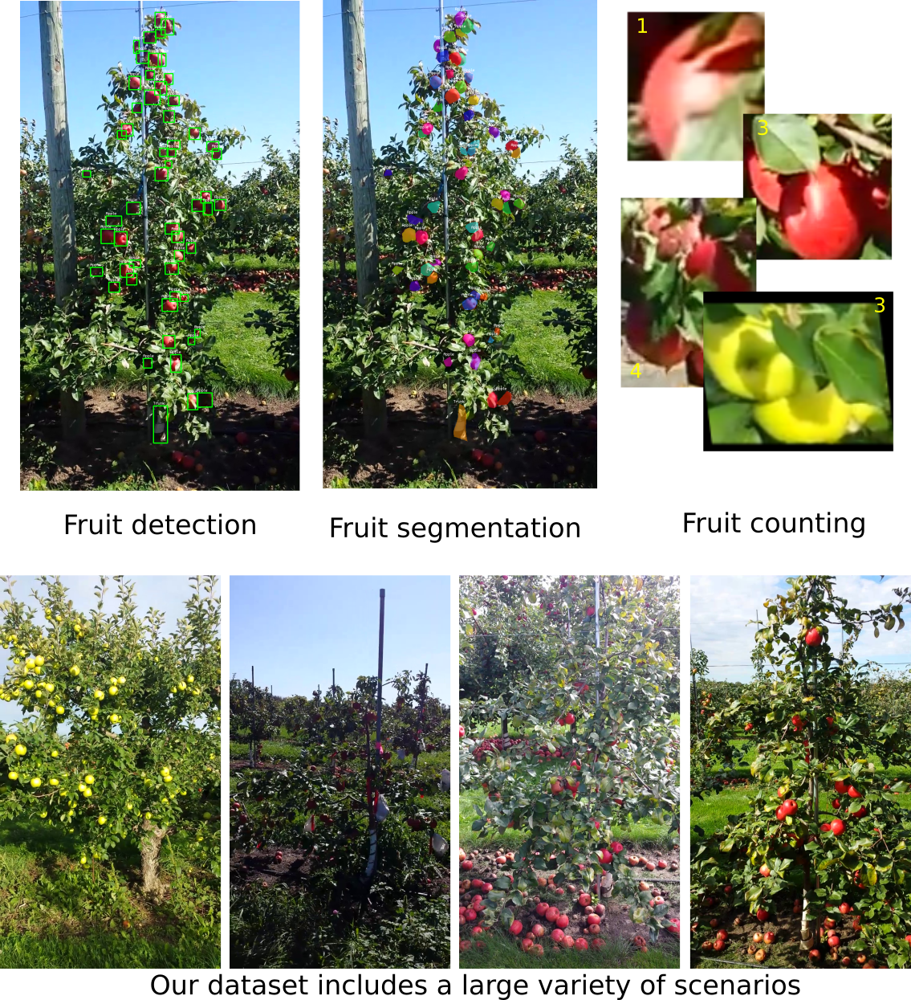

# MinneApple: A Benchmark Dataset for Apple Detection and Segmentation
This is the code to our [paper](https://arxiv.org/abs/1909.06441) MinneApple: A Benchmark Dataset for Apple Detection and Segmentation. We provide example scripts for loading data, training Faster RCNN and Mask RCNN on the MinneApple dataset and example evaluation scripts.

<p align="center">
	
</p>

## Evaluation
As of November 1st, 2019 here are our latest models along with their respective benchmark results.

### Apple Detection
| Method | Backbone | AP @ IoU=.50:.05:.95 | AP @ IoU=.50  |  AP @ IoU=.74 | AP_small | AP_medium | AP_large|
|---|---|---|---|---|---|---|---|
| Tiled Faster RCNN  |  ResNet50  |  0.341 | 0.639 | 0.339  | 0.197  | 0.519  | 0.208  |
| Faster RCNN  |  ResNet50 |  0.438 |  0.775 | 0.455  | 0.297  | 0.578  | 0.871  |
| Mask RCNN  | ResNet50  | 0.433  |  0.763 | 0.449  | 0.295  | 0.571  |  0.809 |

### Apple Segmentation
| Method | Backbone | IoU | Class IoU (Apple) |  Pixel Accuracy | Class Accuracy (Apple) |
|---|---|---|---|---|---|
| Semi-supervised GMM  |  -  |  0.635 | 0.341 | 0.968  | 0.455  | 
| User-supervised GMM  |  -  |  0.649 |  0.455 | 0.959  | 0.634  | 
| UNet (no pretraining)  | ResNet50  | 0.678  |  0.397 | 0.960  | 0.818  | 
| UNet (ImageNet pretraining)  | ResNet50  | 0.685  |  0.410 | 0.962  | 0.848  | 

### Apple Counting
| Method | Backbone | Mean Accurracy | 
|---|---|---|
| GMM  |  -  |  0.816 | 
| CNN  |  ResNet50  |  0.908 |

## Installation
* Setup a Python 3 environment
* Install Pytorch (1.0.1 or higher) and TorchVision
* Install some other packages:
```
# Install necessary packages
pip install Pillow opencv-python sklearn numpy
```
* Clone this repository and enter it
```
git clone https://github.com/nicolaihaeni/MinneApple.git
cd MinneApple
```

## Data Loader
The file ```data/apple_dataset.py``` contains a custom dataset class that allows loading images and masks on the fly and extract bounding boxes and segmentation masks. Modify this class accordingly if you need additional inputs to your network.

## Training
To train a network on the MinneApple dataset make sure that you download the dataset first from [here](https://conservancy.umn.edu/handle/11299/206575).
* Now you can train a Faster RCNN or Mask RCNN network with the commands below.
```
# Train Faster RCNN
python train_rcnn.py --data_path /path/to/MinneApple/dataset --model frcnn --epochs 50 --output-dir /path/to/checkpoint/directory
# Train Mask RCNN
python train_rcnn.py --data_path /path/to/MinneApple/dataset --model mrcnn --epochs 50 --output-dir /path/to/checkpoint/directory

```

## Prediction 
To use a model for prediction run the following command:
```
# Predict for Faster RCNN
python predict_rcnn.py --data_path /path/to/MinneApple/dataset --output_file /path/to/which/to/write/the/predictions --weight_file /path/to/a/weight/file --device [one out of: cpu/gpu] --frcnn
# Predict for Mask RCNN
python predict_rcnn.py --data_path /path/to/MinneApple/dataset --output_file /path/to/which/to/write/the/predictions --weight_file /path/to/a/weight/file --device [one out of: cpu/gpu] --mrcnn
```

## Evaluation scripts
To guarantee a fair comparison of your approach with others we have setup codalab competitions for [fruit detection](https://competitions.codalab.org/competitions/21718), [fruit segmentation](https://competitions.codalab.org/competitions/21694) and [fruit counting](https://competitions.codalab.org/competitions/21719). 

The evaluation servers are result submission only, so make sure to follow the instructions on the respective website.
The evaluation scripts on the server closely follow the provided evaluation scripts in this codebase.

## Citation
If you use MinneApple or this code base in your work, please cite
```
@misc{hani2019minneapple,
    title={MinneApple: A Benchmark Dataset for Apple Detection and Segmentation},
    author={Nicolai Häni and Pravakar Roy and Volkan Isler}
    year={2019},
    eprint={1909.06441},
    archivePrefix={arXiv},
    primaryClass={cs.CV}
}
```
